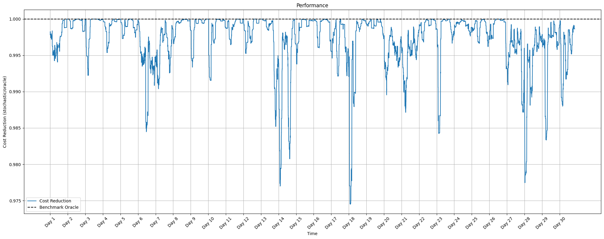
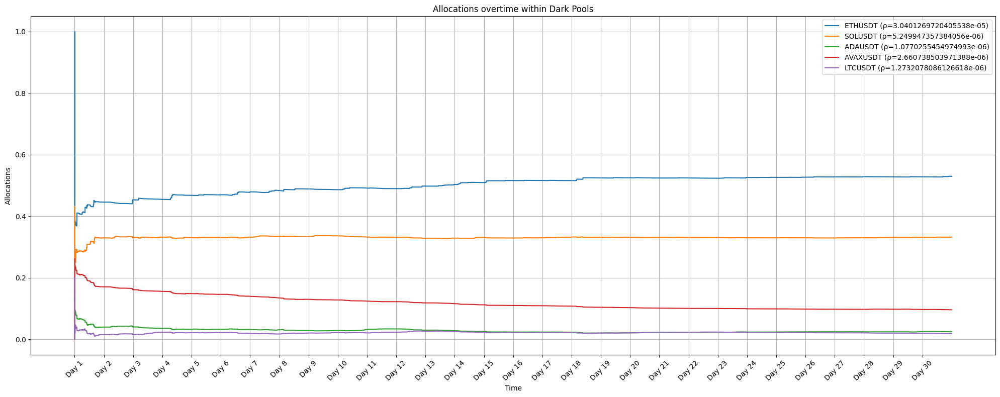

# Optimal Execution: Splitting Orders Across Dark Liquidity Pools

Stochastic-approximation approach to routing an order across $N$ dark
pools with unknown, time-varying liquidity.

## 1. Problem Formulation

A random volume $V>0$ is executed across $N$ dark pools. Pool $i$ offers
a rebate $\rho_i\in(0,1)$ on the reference price $S$ and has unobserved
random capacity $D_i\ge0$. Routing a fraction $r_i$ of $V$ to pool $i$
fills $\min(r_iV,D_i)$ there; the rest executes on the lit market at $S$.

Minimizing expected execution cost is equivalent to finding $r^*$:

$$
r^* \in \arg\max_{r \in \mathcal{P}_N} \sum_{i=1}^{N} \rho_i \mathbb{E}[\min(r_i V, D_i)] =: \arg\max_{r \in \mathcal{P}_N} \sum_{i=1}^{N} \varphi_i(r_i),\qquad \mathcal{P}_N := \{r \in \mathbb{R}_+^N : \sum_{i=1}^N r_i = 1\}.
$$

## 2. Stochastic Approximation

By KKT condition, the maximizer $r^*$ is characterized by:

$$
\mathbb{E}\left[\underbrace{V\left(\rho_i \mathbf{1}_{\{r_i^* V < D_i\}} - \frac{1}{N}\sum_{j=1}^N \rho_j \mathbf{1}_{\{r_j^* V < D_j\}}\right)}_{=:H_i(r^*,Y)}\right] = 0, \qquad \forall i, \quad Y=(V,D_1,\dots,D_N).
$$

So $r^*$ solves $h(r):=\mathbb{E}[H(r,Y)]=0 \iff \begin{bmatrix} \mathbb{E}[H_1(r, Y)] \\ \mathbb{E}[H_2(r, Y)] \\ \vdots \\ \mathbb{E}[H_N(r, Y)] \end{bmatrix} = \begin{bmatrix} 0 \\ 0 \\ \vdots \\ 0 \end{bmatrix}$ — a zero of an expectation that can be **sampled** (one realized fill/no-fill per trading period) even though the distribution of $(V,D_i)$ is never known.

### Recursive procedure

$$
r^{(k+1)} = \Pi_{\mathcal{P}_N}\left(r^{(k)} + \gamma_{k+1}H\left(r^{(k)},Y^{(k+1)}\right)\right), \qquad \gamma_k=\frac{c}{k},
$$

with $\Pi_{\mathcal{P}_N}$ the projection onto the simplex. Under $\sum\gamma_k=\infty$, $\sum\gamma_k^2<\infty$ and concavity of $\Phi$, $r^{(k)} \xrightarrow{\mathbb{P}\text{-a.s.}} r^*$ a.s.

## 3. Experimental Results

Calibrated on real Binance market data benchmarked against an oracle with perfect foresight. 

*Note: dark pool capacities $D_i$ are pseudo-real — no public dark-pool liquidity data exists for crypto, so $D_i$ is proxied from correlated reference-asset volume rather than directly observed.*

*Performance ratio $CR^{\text{opti}}/CR^{\text{oracle}}$ over time — how much of the oracle's unattainable cost saving the online algorithm captures.*

*Evolution of $r^{(k)}$ per pool, converging away from the uniform starting allocation toward the learned optimal split.*# Optimal Execution: Splitting Orders Across Dark Liquidity Pools

Stochastic-approximation approach to routing an order across $N$ dark
pools with unknown, time-varying liquidity.

## 1. Problem Formulation

A random volume $V>0$ is executed across $N$ dark pools. Pool $i$ offers
a rebate $\rho_i\in(0,1)$ on the reference price $S$ and has unobserved
random capacity $D_i\ge0$. Routing a fraction $r_i$ of $V$ to pool $i$
fills $\min(r_iV,D_i)$ there; the rest executes on the lit market at $S$.

Minimizing expected execution cost is equivalent to finding $r^*$:

$$
r^* \in \argmax_{r \in \mathcal{P}_N} \sum_{i=1}^{N} \rho_i \, \mathbb{E}[\min(r_i V, D_i)] =: \argmax_{r \in \mathcal{P}_N} \sum_{i=1}^{N} \varphi_i(r_i),\qquad
\mathcal P_N := \left\{r\in\mathbb R_+^N : \sum_{i=1}^N r_i = 1\right\}.
$$

## 2. Stochastic Approximation

By KKT condition, the maximizer $r^*$ is characterized by:

$$
\mathbb E\left[\underbrace{V\left(\rho_i\mathbb 1_{\{r_i^*V<D_i\}} - \tfrac1N\sum_{j=1}^N\rho_j\mathbb 1_{\{r_j^*V<D_j\}}\right)}_{=:H_i(r^*,Y)}\right] = 0, \qquad \forall i, \quad Y=(V,D_1,\dots,D_N).
$$

So $r^*$ solves $h(r):=\mathbb E[H(r,Y)]=0 \iff \begin{bmatrix} \mathbb{E}[H_1(r, Y)] \\ \mathbb{E}[H_2(r, Y)] \\ \vdots \\ \mathbb{E}[H_N(r, Y)] \end{bmatrix} = \begin{bmatrix} 0 \\ 0 \\ \vdots \\ 0 \end{bmatrix}$ — a zero of an expectation that can be **sampled** (one realized fill/no-fill per trading period) even though the distribution of $(V,D_i)$ is never known.

### Recursive procedure

$$
r^{(k+1)} = \Pi_{\mathcal P_N}\left(r^{(k)} + \gamma_{k+1}H\left(r^{(k)},Y^{(k+1)}\right)\right), \qquad \gamma_k=\frac{c}{k},
$$

with $\Pi_{\mathcal P_N}$ the projection onto the simplex. Under $\sum\gamma_k=\infty$, $\sum\gamma_k^2<\infty$ and concavity of $\Phi$, $r^{(k)} \xrightarrow{\mathbb{P}\text{-a.s.}} r^*$ a.s.

## 3. Experimental Results

Calibrated on real Binance market data benchmarked against an oracle with perfect foresight. 

*Note: dark pool capacities $D_i$ are pseudo-real — no public dark-pool liquidity data exists for crypto, so $D_i$ is proxied from correlated reference-asset volume rather than directly observed.*

*Performance ratio $CR^{\text{opti}}/CR^{\text{oracle}}$ over time — how much of the oracle's unattainable cost saving the online algorithm captures.*

*Evolution of $r^{(k)}$ per pool, converging away from the uniform starting allocation toward the learned optimal split.*
